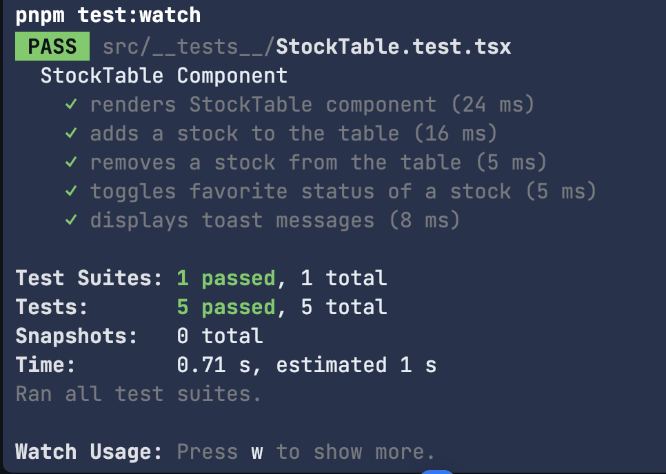
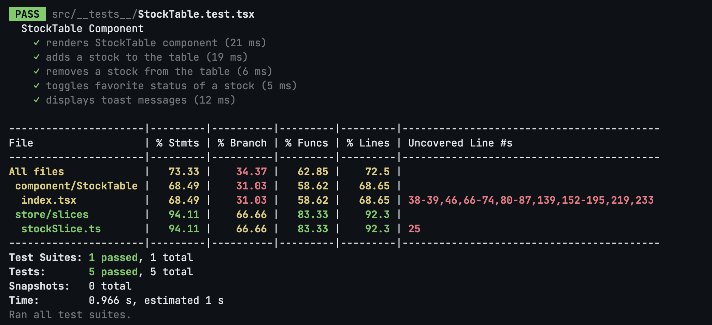

# Funding Pips Frontend Assessment

Tech stack:
- Next.js
- TypeScript
- Biome
- Jest
- Turbopack
- Husky
- redux-toolkit
- redux-thunk
- redux-persist

### Mocked data based on Alphavantage API
I used mock data for the API call cause I had limitation call the real API.

---

### Storage and state
I used redux and redux-toolkit and redux-persist for the state management and storage.

##  How to run the project

### `dev`
- **Command:** `next dev --turbopack`
- **Description:** Starts the development server using Next.js with Turbopack for enhanced performance during development.

### `build`
- **Command:** `next build`
- **Description:** Builds the Next.js application for production. This optimizes the code and generates static assets.

### `start`
- **Command:** `next start`
- **Description:** Starts the production server for the built application.

### `lint`
- **Command:** `next lint`
- **Description:** Runs the Next.js linter to check for code quality and stylistic issues.

### `test`
- **Command:** `jest`
- **Description:** Executes the Jest testing framework to run all test cases.

### `test:watch`
- **Command:** `jest --passWithNoTests --watch`
- **Description:** Runs Jest in watch mode, automatically re-running tests upon file changes. The `--passWithNoTests` flag allows the script to succeed even if no tests are found.

### `biome:format`
- **Command:** `biome format --write`
- **Description:** Formats the codebase using Biome, ensuring consistency in code style.

### `biome:lint`
- **Command:** `biome check`
- **Description:** Lints the codebase using Biome to identify potential issues or deviations from the defined code style.

### `postinstall`
- **Command:** `husky install`
- **Description:** Runs after dependencies are installed, setting up Husky for managing Git hooks.

### `cypress:open` [it's not complete yet]
- **Command:** `cypress open`
- **Description:** Opens the Cypress Test Runner for running end-to-end tests interactively.

--- 

### SOLID

Regarding the `S` for `SOLID` I just tried to keep each function(component as a function as well)
just be responsible for a single task. That's why I just created a separate component for every part
and also keep it simple stupid.

---

### Functional test

### Coverage test

#### Why Biome?
- Simplicity: Biome simplifies the development workflow by unifying tools like linters, formatters, and analyzers into one fast and efficient solution.
- Consistency: Code consistency is critical for collaboration. Biome enforces a uniform style across the codebase, reducing friction in reviews and onboarding.
- Efficiency: Time is a precious resource. By automating tedious tasks like formatting and catching errors early, Biome lets us focus on what truly matters: building features and solving problems.
- Developer Experience: We believe tools should empower developers, not frustrate them. Biome’s lightweight design and speed ensure a seamless experience, even in large projects.
